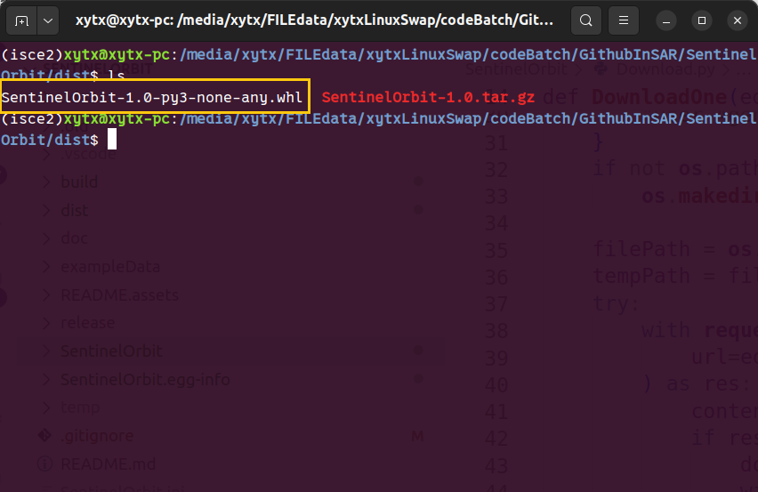
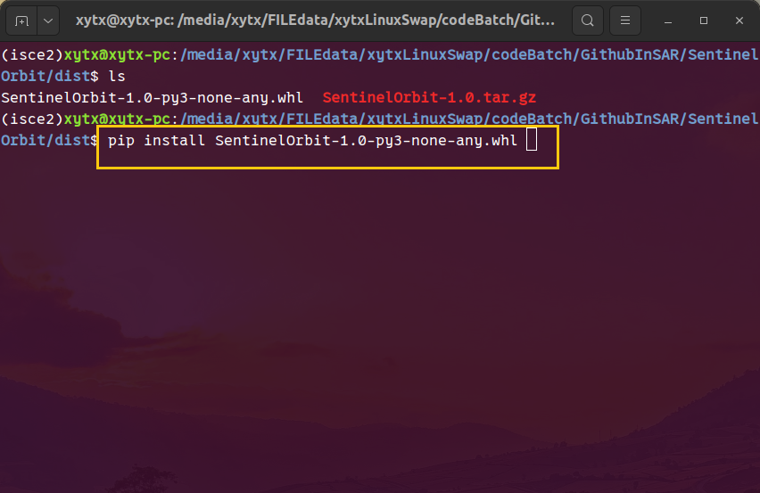
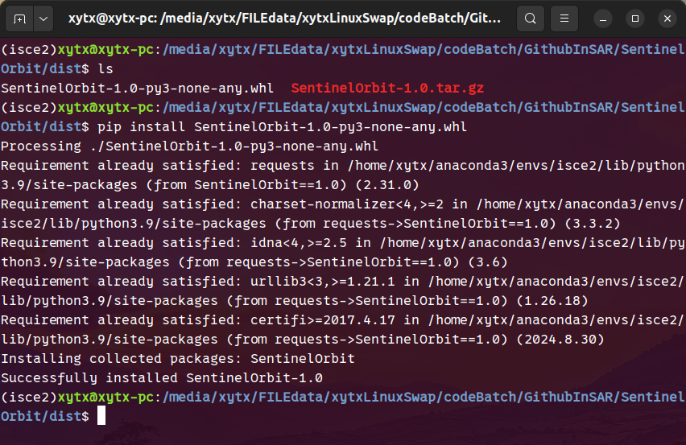
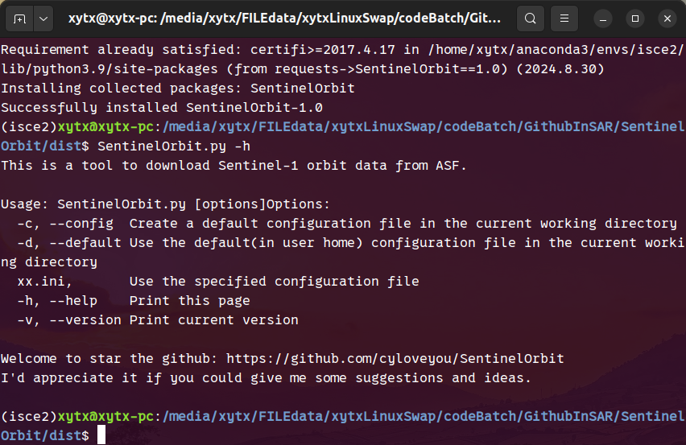

# SentinelOrbit

# 项目介绍

SentinelOrbit是一个python三方模块，主要由Python3编程语言，可以实现自动批量从[ASF官网](https://s1qc.asf.alaska.edu/aux_poeorb/)下载哨兵卫星精密轨道数据。

# 安装方法

## 安装依赖库

```pthon
pip install requests
```

## 下载whl文件

项目已打包好.whl文件，下载whl文件，使用pip命令安装即可。







使用命令`SentinelOrbit.py -h`可以查看是否安装成功



# 快速上手

## 1.在当前工作目录下生成配置文件(.ini)

```python
SentinelOrbit.py -c
```

该命令会生成内容如下的配置文件

```
[ASFInfo]
userid = xxxxxx
userpwd = xxxxxx

[SLCInfo]
inputslc = .

[OrbitInfo]
savepath = .

[OtherInfo]
ipport = 
workers = 3
```
## 2.修改配置文件内容

配置参数解释如下表：

|    参数     | 默认值 |                             解释                             |
| :---------: | :----: | :----------------------------------------------------------: |
| **userid**  | xxxxxx |                      ASF官网的登录账号                       |
| **userpwd** | xxxxxx |                      ASF官网的登录密码                       |
|  inputslc   |   .    | 工具将根据此项寻找SLC数据，可以是包含SLC数据(.zip or .SAFE)的文件夹(相对路径or绝对路径)，可以是ASF下载的downtownload.py批量下载SLC的python脚本文件，也可以是metalink文件。默认在当前工作路径下寻找SLC数据 |
|  savepath   |   .    |         轨道数据保存文件夹。默认保存到当前工作目录下         |
|   ipport    |  None  |        是否使用科学上网。默认不填则表示不使用科学上网        |
|   workers   |   3    |               进程数。默认开启3个进程进行下载                |

按照上表修改配置文件，**其中加粗参数为必改项**。

## 3.开始下载

```python
SentinelOrbit.py SentinelOrbit.ini
```

# 主要目录结构

```
├── build
├── dist
│   ├── SentinelOrbit-1.0-py3-none-any.whl
│   └── SentinelOrbit-1.0.tar.gz
├── doc
│   └── 模块结构设计.xmind
├── exampleData
│   ├── asf-datapool-results-2024-10-25_10-46-01.metalink
│   └── download-all-2024-10-25_09-09-42.py
├── README.assets
├── README.md
├── SentinelOrbit
│   ├── Cookie.py
│   ├── Download.py
│   ├── ExtractDate.py
│   ├── ExtractSLC.py
│   ├── FindOrbit.py
│   ├── __init__.py
│   ├── InputParam.py
│   ├── Message.py
│   ├── __pycache__
├── SentinelOrbit.egg-info
├── setup.py
```


# 关于作者

<div>
    
    
    
    <a href="https://blog.csdn.net/weixin_64989228?spm=1000.2115.3001.5343"></a>
    <!-- visitor statistics logo 访问量统计徽标 -->
    
</div>
<div>&nbsp;</div>

<p>&emsp;&emsp;👋 Hello，您好，我是小 y 同 学。</p>
<p>&emsp;&emsp;👨‍🎓 西安科技大学测绘工程专业本科生。</p>
<p>&emsp;&emsp;✨ 热爱编程、喜欢折腾、尝试过不少技术但掌握的还都很浅。</p>
<p>&emsp;&emsp;📚 业余了解一些CATIA3D建模、Python爬虫、PIE-SDK二次开发、3D打印、激光切割技术。</p>
<p>&emsp;&emsp;💻 常用编程语言有 Python、C#、MATLAB、C、C++，对Linux也有涉猎。</p>
<p>&emsp;&emsp;💡 希望可以为祖国测绘遥感事业献绵薄之力，为建设美好世界贡献出自己的一份力。</strong></p>
<p><strong>&emsp;&emsp;🌍🌎🌏 Hope to make some achievements and contribute my own efforts to building a better world. 🌍🌎🌏</strong></p>
<div>&nbsp;</div>
</div>

# 其他

欢迎给出建议~
